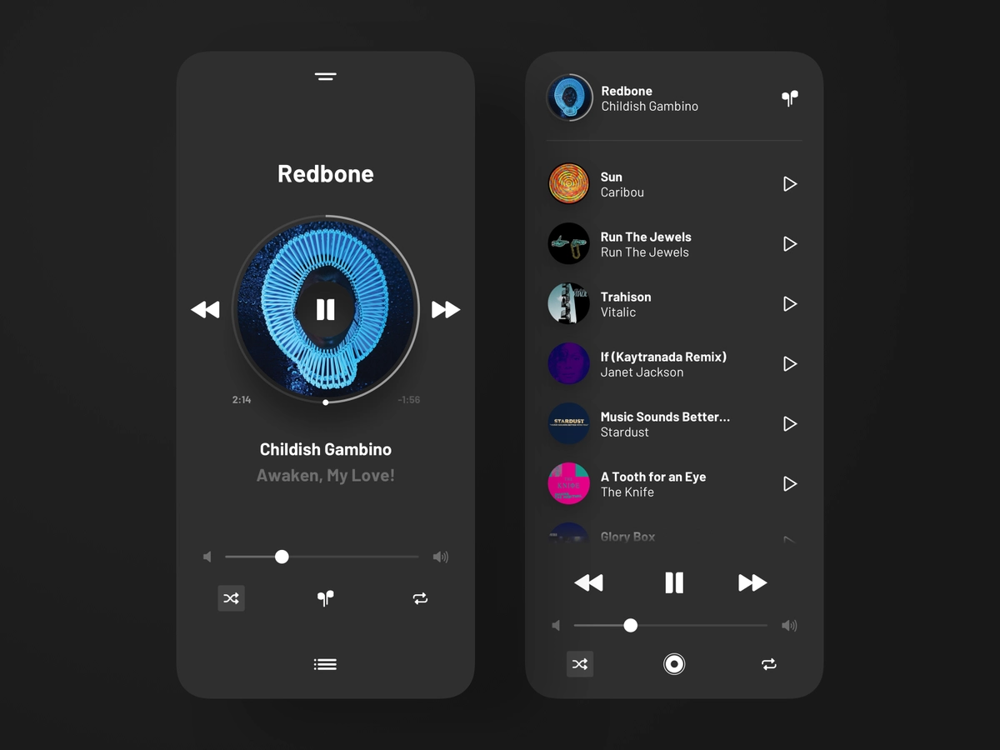
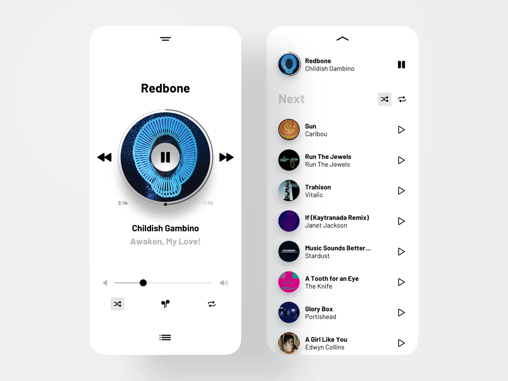

[](https://github.com/nicklima/react-audio-player/)
[](https://github.com/nicklima/react-audio-player/issues)

# React Audio Player - Dribbble Inspirated

React Audio Player Inspired by Dribbble Layout made by [Arkadiusz Stanikowski](https://dribbble.com/vhs-kid)

**Dark Mode**

</br>

**Light Mode**

</br>

## Credits

- [Audio Player Inspiration](https://letsbuildui.dev/articles/building-an-audio-player-with-react-hooks)
- [Dribbble Layout Dark](https://dribbble.com/shots/10221294-Music-player-exploration-1-1-dark-mode)
- [Dribbble Layout Light](https://dribbble.com/shots/10184887-Music-player-exploration-1)

## Preview

[Click here](https://react-audio-player-dribbble.vercel.app) to view the code runing.

## Run the code on your local machine

```bash

git clone git@github.com:nicklima/react-audio-player.git

```

```bash

yarn && yarn start

```

## TODO

Here are some features that i want to add. If you want to help, send me a PR

- [ ] Improve performance
- [ ] Swap the circular track to control audio

## License

MIT © [Nick Lima](https://github.com/nicklima)
